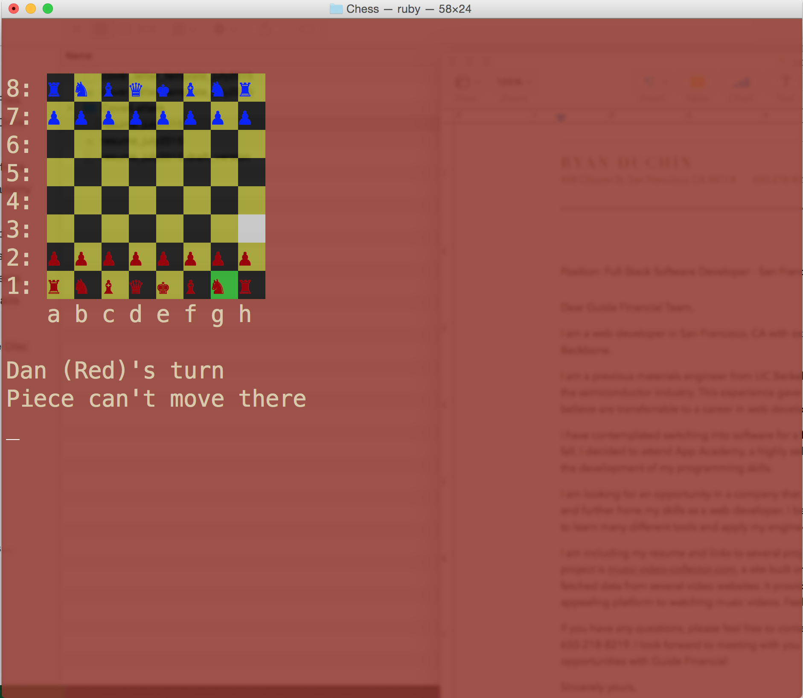
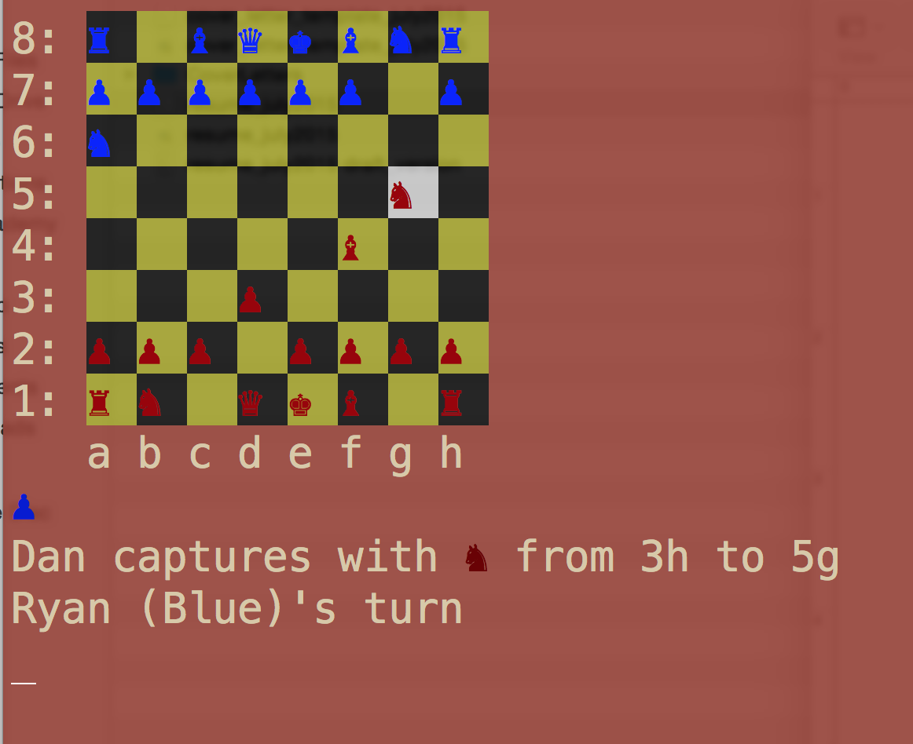
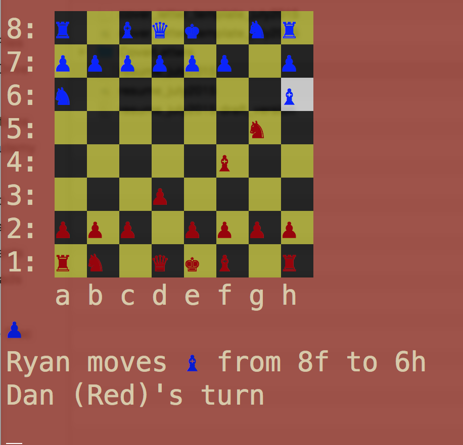

This is a game of chess made in Ruby to be run in Terminal.

To try it out, navigate to the folder in Terminal and run the command:
'ruby Chess/game.rb'

The game includes logic for the different pieces and combines logic into 'sliding pieces' (Rook/Bishop/Queen), 'stepping pieces' (King/Knight), and pawns (move and attack).

